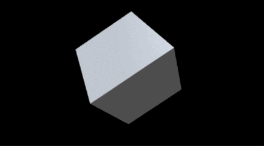

# npm_three_template

> A template for using three.js with node.js modules and browserify and gulp and etc



## Usage

If you simply want a template to write your own apps, perhaps get [a fresh ZIP from the repo](https://github.com/sole/npm_three_template/archive/master.zip). 

Alternatively, you can also clone the repository:

```bash
git clone https://github.com/sole/npm_three_template.git
```

Then cd to the directory and run `npm install` to get the dependencies fulfilled.

Once that is done you can run...

```bash
npm start
```

this will build the project to the `build/` folder. Open `build/index.html` to see the results. It will give you... a rotating cube with a nice material as in the screenshot!

It also starts up a file watching service, so if you modify any file on the `src` folder, the project will be rebuilt automatically and you just need to reload `index.html` in your browser.

You can press CTRL+C to stop the file watcher.

## Where is the code?

Everything is started in `src/js/main.js`. Of course you don't need to put everything in that file - you can create different files to split your code in classes and require it from `main.js`. E.g. if you wanted to use a `SpecialMesh`, you could put the code in `src/js/SpecialMesh.js` and require it from `main.js`:

**`src/js/SpecialMesh.js`**
```javascript
function SpecialMesh(/* ... */) {
	// ...
}

module.exports = SpecialMesh;
```

**`src/js/main.js`**
```javascript
// ...

var SpecialMesh = require('./SpecialMesh');

var thingy = new SpecialMesh();
scene.add(thingy);

// ...
```

When the code is built, all these files will be joined together in a single file called `build/js/bundle.js`.

